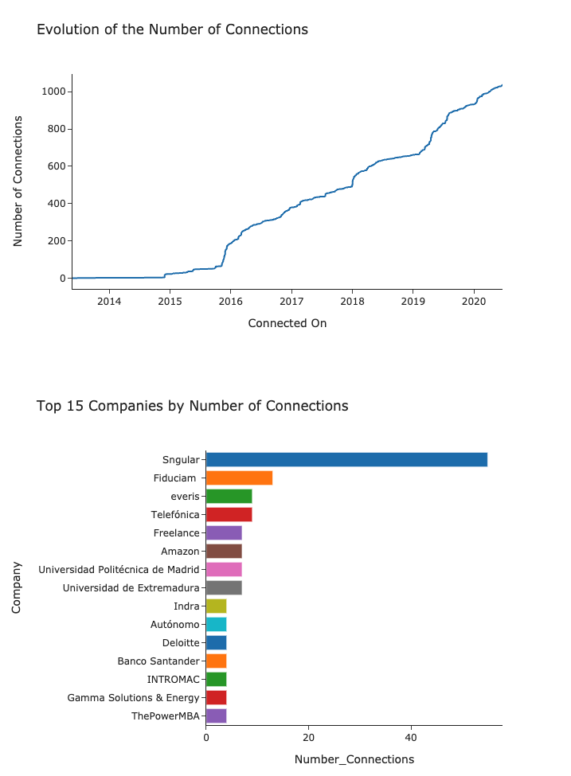
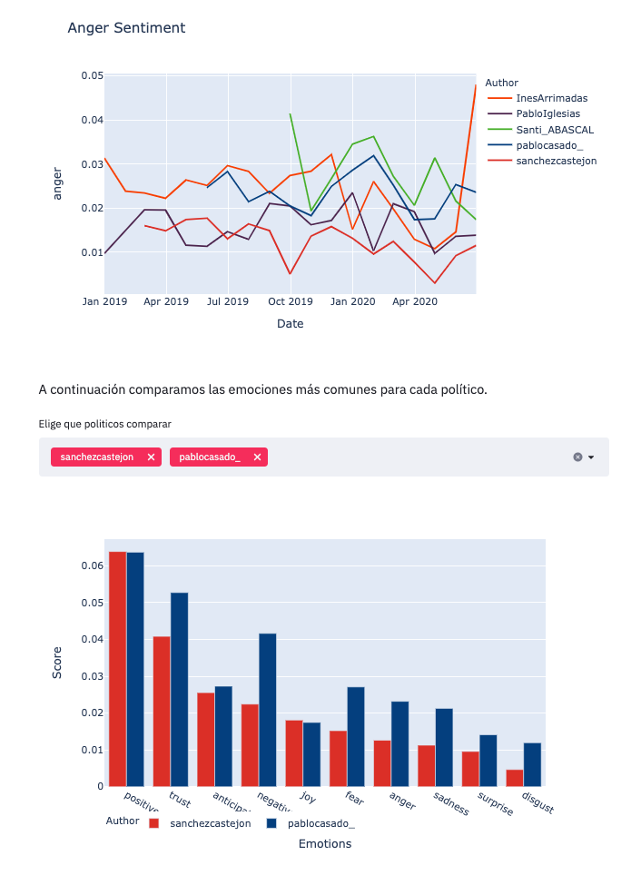
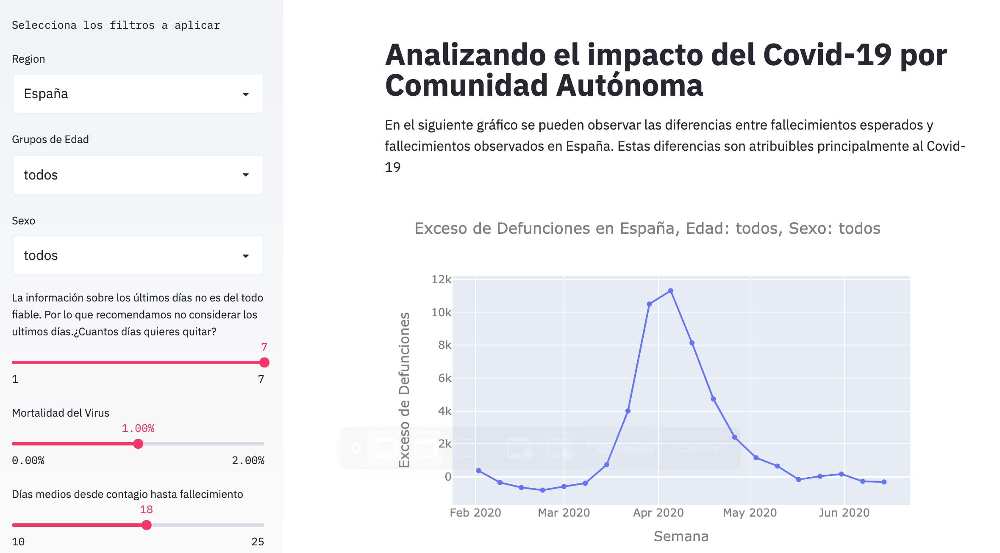

# Table of Contents
1. [Introduction](#Introduction)
2. [Some paragraph](#paragraph1)
    1. [Sub paragraph](#subparagraph1)
3. [Another paragraph](#paragraph2)

## This is the introduction 
Some introduction text, formatted in heading 2 style

## Some paragraph 
The first paragraph text

### Sub paragraph 
This is a sub paragraph, formatted in heading 3 style

## Another paragraph 
The second paragraph text

# Introduction

In this site I share a few personal projects that I have develop on my free time. While working on them, I have always have the following objectives:
1. Try to **LEARN** new things about Data Science, Data Engineering, Software Development and many other things.
2. Build a **USER-FRIENDLY** “final product” allowing people to have fun with it.
3. Last but not least, **ENJOY** the building process! 

# Projects

## Linkedin Connections Analyzer
A website is created to facilitate non-technical users to extract insights about their Linkedin connections data. In the website is explained how to download information about your connections from Linkedin. Then, uploading this info to the site you would be able to see charts that allow to know more about your network

On top of that, in order to collect some super basics metrics, I set up a couple of triggers after certain actions of the user. 

This has been the first project where I have worked with a file provided by the user :) 

[Site](https://linkedin-connections-charts.herokuapp.com/) 

[Repo](https://github.com/camorales197/linkedin_connections) 

## Politicians Tweets Sentiments Analysis

Sentiment analysis study to the tweets of the main Spanish Politicians. For each politician, their last 3,200 tweets have been collected via API, dated June 15, 2020

The insights are published in a public site with dynamic graphs that allow users to play with the data. 

I have discovered a few different NLP libraries super interesting. I definitely want to do dig deeper in this area!  

[Site](https://twitter-sentiment-spain.herokuapp.com/) 

[Repo](https://github.com/camorales197/tweets_sentiments) 

## Covid19 Spain - Dashboard

In this project I represent data from [MoMo](https://momo.isciii.es/public/momo/dashboard/momo_dashboard.html#nacional) and apply some calculations to estimate the number of people currently infected with the virus. 

[Site](https://seguimiento-covid19-espana.herokuapp.com/)

[Repo](https://github.com/camorales197/covid-app)

# Contact

If you feel like talking you can [Hit me up on Linkedin](https://www.linkedin.com/in/carloscamorales/) or [Send me an email](mailto:camorales@outlook.com?subject=Hello!)

